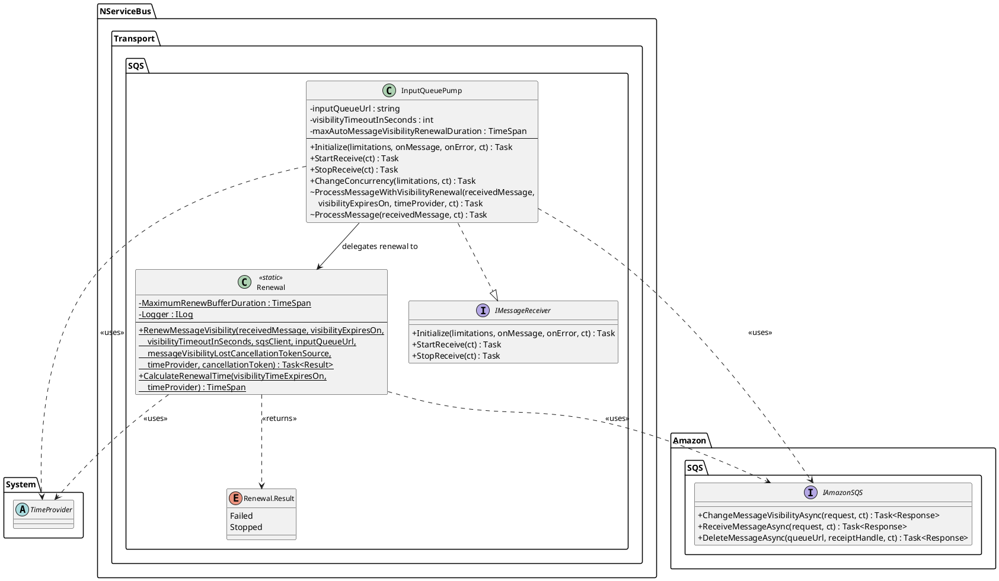
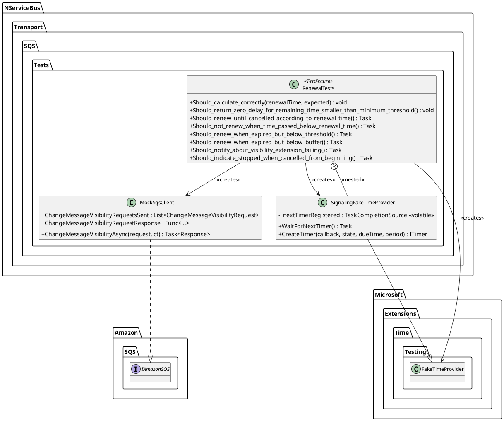
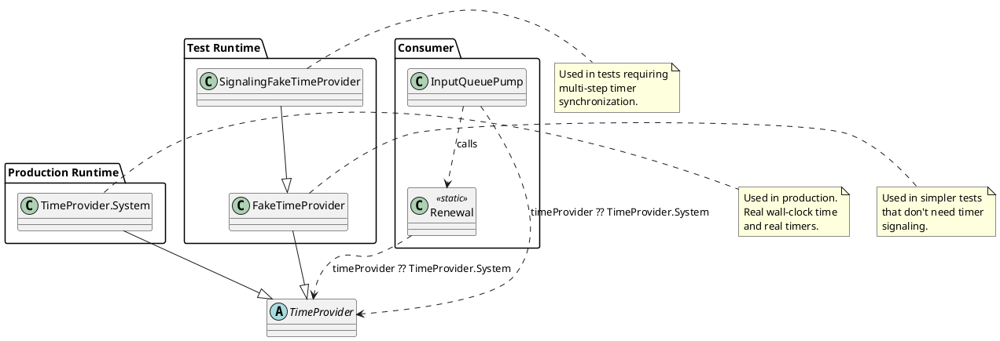

# Class Diagrams

## Complete Class Hierarchy

```plantuml
@startuml SignalingFakeTimeProvider_ClassDiagram

skinparam classAttributeIconSize 0
skinparam classFontSize 12
skinparam class {
    BackgroundColor White
    BorderColor Black
    ArrowColor Black
}

package "System (.NET BCL)" {
    abstract class TimeProvider {
        + {static} System : TimeProvider
        --
        + {abstract} GetUtcNow() : DateTimeOffset
        + GetLocalNow() : DateTimeOffset
        + {abstract} LocalTimeZone : TimeZoneInfo
        + {abstract} TimestampFrequency : long
        + {abstract} GetTimestamp() : long
        + {abstract} CreateTimer(callback, state, dueTime, period) : ITimer
    }

    interface ITimer {
        + Change(dueTime : TimeSpan, period : TimeSpan) : bool
    }

    interface IDisposable {
        + Dispose() : void
    }

    interface IAsyncDisposable {
        + DisposeAsync() : ValueTask
    }
}

package "System.Threading (.NET BCL)" {
    class TaskCompletionSource {
        + TaskCompletionSource(creationOptions)
        --
        + Task : Task
        + TrySetResult() : bool
        + SetResult() : void
        + TrySetCanceled() : bool
        + TrySetException(exception) : bool
    }

    delegate TimerCallback {
        + Invoke(state : object) : void
    }
}

package "Microsoft.Extensions.Time.Testing" {
    class FakeTimeProvider {
        + FakeTimeProvider()
        + FakeTimeProvider(startDateTime : DateTimeOffset)
        --
        + Start : DateTimeOffset
        + GetUtcNow() : DateTimeOffset
        + Advance(delta : TimeSpan) : void
        + SetUtcNow(value : DateTimeOffset) : void
        + CreateTimer(callback, state, dueTime, period) : ITimer
    }
}

package "NServiceBus.Transport.SQS.Tests" {
    class SignalingFakeTimeProvider {
        - _nextTimerRegistered : TaskCompletionSource <<volatile>>
        --
        + WaitForNextTimer() : Task
        + CreateTimer(callback, state, dueTime, period) : ITimer
    }
}

ITimer --|> IDisposable
ITimer --|> IAsyncDisposable
FakeTimeProvider --|> TimeProvider
SignalingFakeTimeProvider --|> FakeTimeProvider
SignalingFakeTimeProvider --> TaskCompletionSource : signals
TimeProvider ..> ITimer : <<creates>>
TimeProvider ..> TimerCallback : <<uses>>

@enduml
```

## Production Components Class Diagram



## Test Infrastructure Class Diagram



## Dependency Injection Flow


