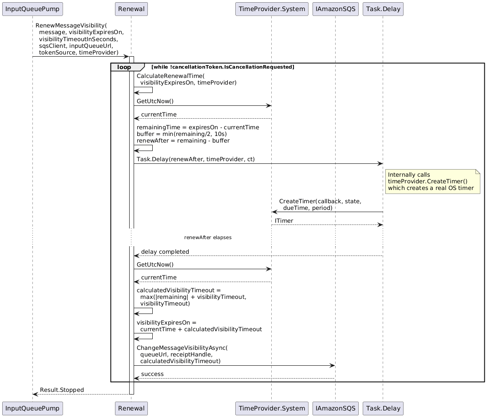
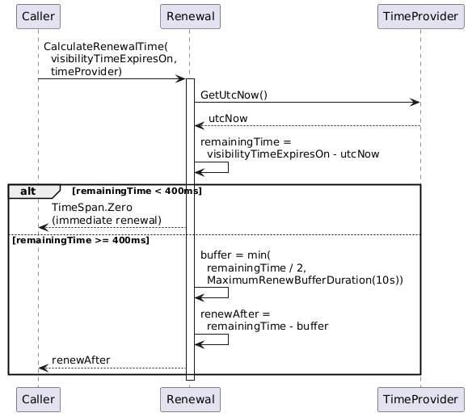
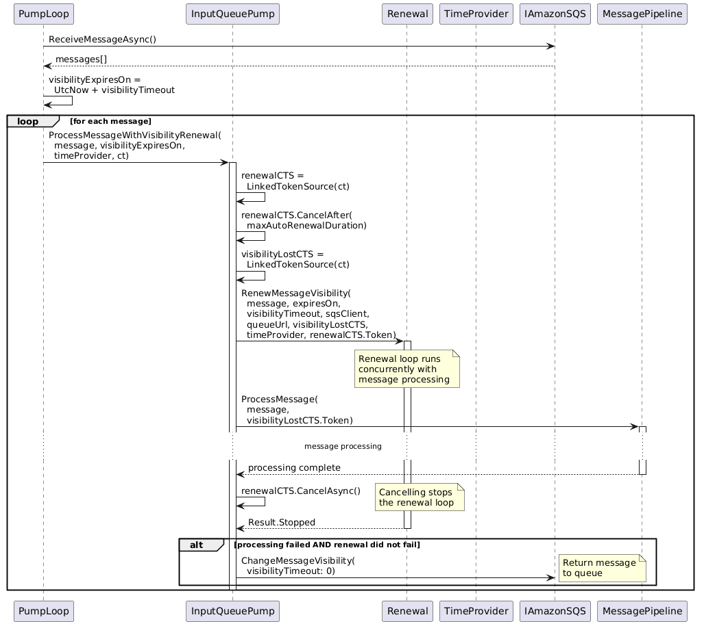
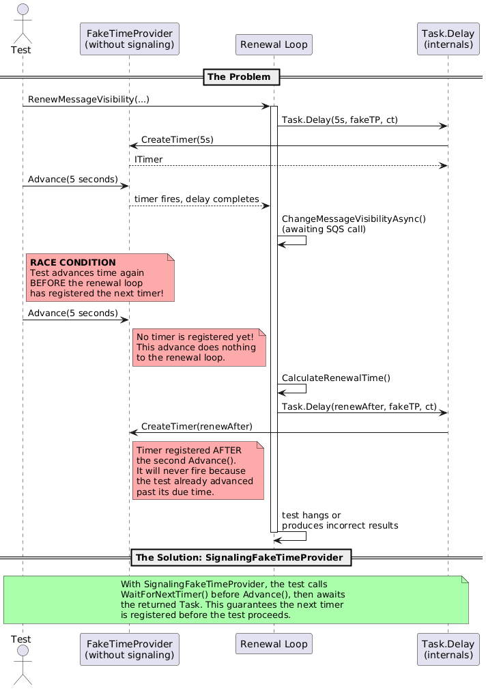
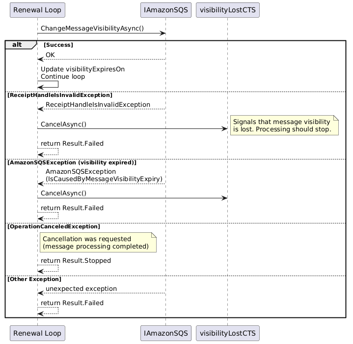

# Sequence Diagrams

## 1. Production Visibility Renewal Loop

Shows the runtime behavior of the renewal loop when processing a message in production with `TimeProvider.System`.

## 2. Test with SignalingFakeTimeProvider (Multi-Renewal)

Shows the test scenario `Should_renew_until_cancelled_according_to_renewal_time` with timer synchronization.

## 3. Renewal Calculation Logic

Shows the decision flow inside `CalculateRenewalTime`.

## 4. InputQueuePump Message Processing with Renewal

Shows how `InputQueuePump` orchestrates concurrent message processing and visibility renewal.

## 5. Race Condition Without SignalingFakeTimeProvider

Demonstrates the race condition that `SignalingFakeTimeProvider` prevents.

## 6. Error Handling in Renewal

Shows how different error scenarios are handled in the renewal loop.

