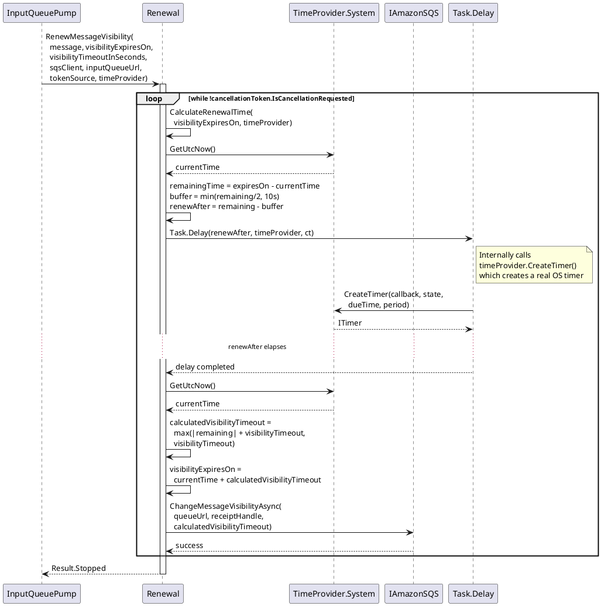
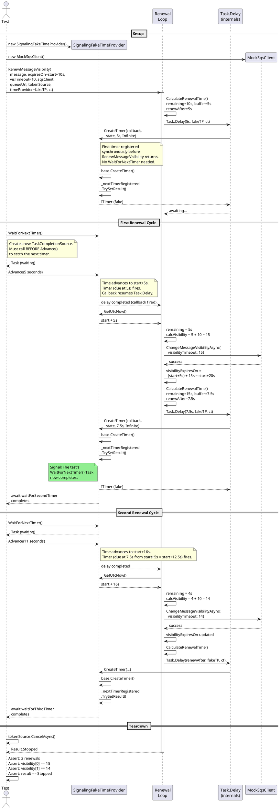
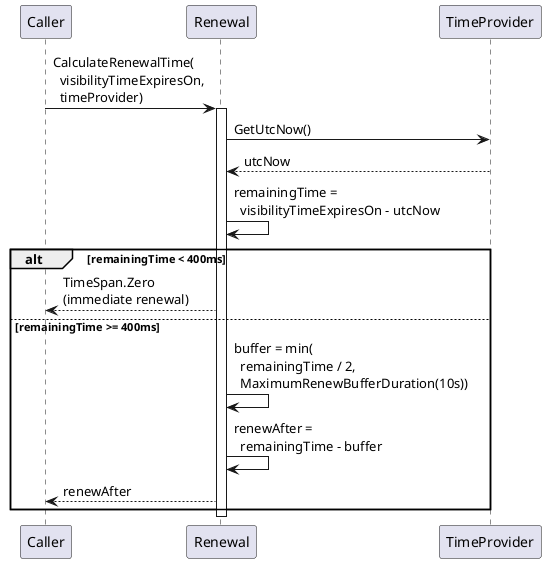
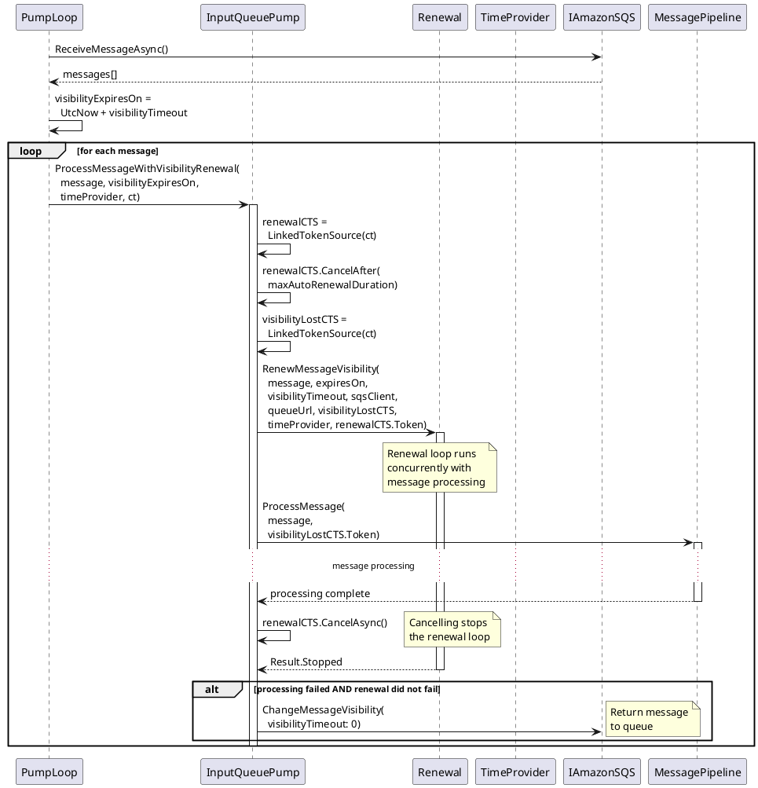
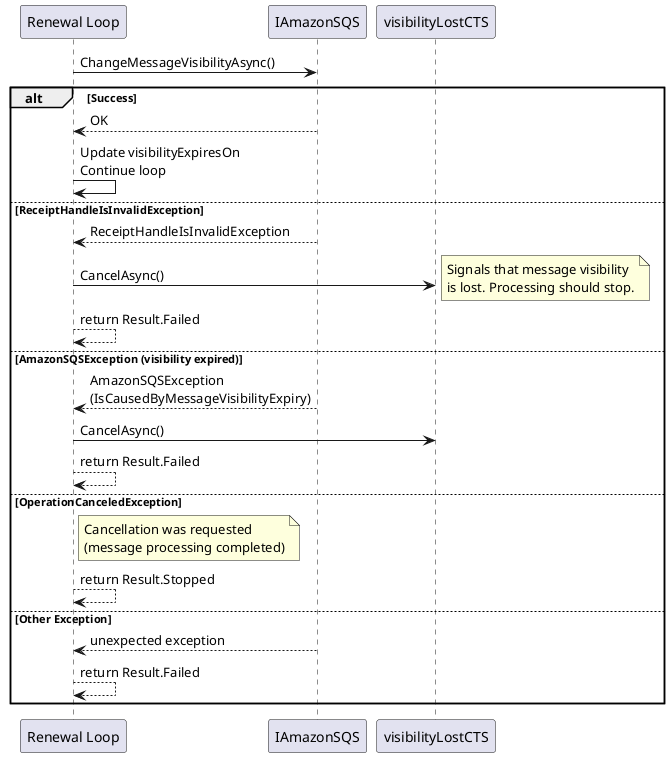

# Sequence Diagrams

## 1. Production Visibility Renewal Loop

Shows the runtime behavior of the renewal loop when processing a message in production with `TimeProvider.System`.



## 2. Test with SignalingFakeTimeProvider (Multi-Renewal)

Shows the test scenario `Should_renew_until_cancelled_according_to_renewal_time` with timer synchronization.



## 3. Renewal Calculation Logic

Shows the decision flow inside `CalculateRenewalTime`.



## 4. InputQueuePump Message Processing with Renewal

Shows how `InputQueuePump` orchestrates concurrent message processing and visibility renewal.



## 5. Race Condition Without SignalingFakeTimeProvider

Demonstrates the race condition that `SignalingFakeTimeProvider` prevents.

```plantuml
@startuml Race_Condition

actor "Test" as Test
participant "FakeTimeProvider\n(without signaling)" as FTP
participant "Renewal Loop" as R
participant "Task.Delay\n(internals)" as Delay

== The Problem ==

Test -> R : RenewMessageVisibility(...)
activate R

R -> Delay : Task.Delay(5s, fakeTP, ct)
Delay -> FTP : CreateTimer(5s)
FTP --> Delay : ITimer

Test -> FTP : Advance(5 seconds)
FTP --> R : timer fires, delay completes

R -> R : ChangeMessageVisibilityAsync()\n(awaiting SQS call)

note right of Test #FFAAAA
  **RACE CONDITION**
  Test advances time again
  BEFORE the renewal loop
  has registered the next timer!
end note

Test -> FTP : Advance(5 seconds)

note right of FTP #FFAAAA
  No timer is registered yet!
  This advance does nothing
  to the renewal loop.
end note

R -> R : CalculateRenewalTime()
R -> Delay : Task.Delay(renewAfter, fakeTP, ct)
Delay -> FTP : CreateTimer(renewAfter)

note right of FTP #FFAAAA
  Timer registered AFTER
  the second Advance().
  It will never fire because
  the test already advanced
  past its due time.
end note

... test hangs or produces incorrect results ...

deactivate R

== The Solution: SignalingFakeTimeProvider ==

note over Test, Delay #AAFFAA
  With SignalingFakeTimeProvider, the test calls
  WaitForNextTimer() before Advance(), then awaits
  the returned Task. This guarantees the next timer
  is registered before the test proceeds.
end note

@enduml
```

## 6. Error Handling in Renewal

Shows how different error scenarios are handled in the renewal loop.


